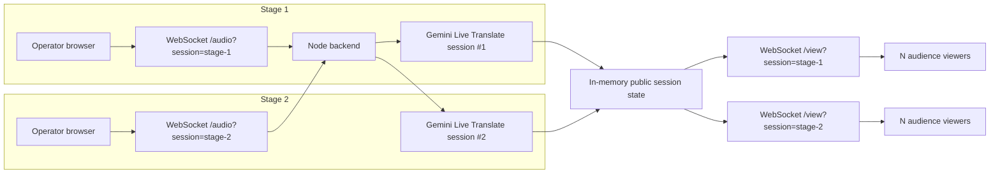

# NerdLingo

Open-source real-time transcription and translation for multi-stage conferences.

NerdLingo captures live conference audio from the browser, transcribes the original speech in real time, and translates English to Spanish with Gemini Live Translate. It is designed for conferences running multiple simultaneous stages.

Built for Nerdearla Vibeathon 2026.

## Why NerdLingo?

Conference accessibility often depends on expensive SaaS tools, manual operation, and systems that are difficult to reproduce across simultaneous stages. NerdLingo explores an open-source architecture in which each stage has one AI audio pipeline and captions are fanned out to many viewers.

It is compatible with a common venue workflow:

```text
Microphones → mixing console / audio board → 3.5 mm or audio interface → mini PC → browser
```

The browser captures the selected operating-system audio input through `getUserMedia`. This describes a compatible operating model; it does not imply that NerdLingo has been used officially by Nerdearla.

## Current Features

- Live browser audio capture with selectable audio input.
- Mono, 16 kHz, signed 16-bit little-endian PCM pipeline.
- Gemini Live Translate for real-time original transcription and English → Spanish translation.
- Independent `stage-1` and `stage-2` producers.
- One active producer per stage, with stale-producer cleanup.
- Operator UI with input guidance, operational status, technical metrics, and graceful Stop/drain.
- Audience pages with stage selection and an Original / Español toggle.
- Mobile-friendly audience UI and WebSocket text fan-out to multiple viewers.
- Transparent live-caption overlay for OBS and vMix Browser/Web inputs.
- Production monitoring dashboard for Stage 1 and Stage 2.
- Viewer reconnection, WebSocket heartbeat, and graceful server shutdown.
- Render backend and Vercel frontend deployments.
- `GET /health` health endpoint.

The Legacy transcription-plus-text-translation pipeline is retained temporarily as a debug/comparison option.

## Live Deployment

- Frontend: <https://nerdlingo-ecru.vercel.app/>
- Backend health: <https://nerdlingo.onrender.com/health>
- Audience: <https://nerdlingo-ecru.vercel.app/session>
- Production monitor: <https://nerdlingo-ecru.vercel.app/monitor>
- Operator Stage 1: <https://nerdlingo-ecru.vercel.app/?session=stage-1>
- Operator Stage 2: <https://nerdlingo-ecru.vercel.app/?session=stage-2>

The current Render deployment uses a free instance and may require a short cold-start period after inactivity.

## Architecture



One active stage maps to approximately one Gemini Live Translate session. Audience viewers consume text updates from the backend; they do not create Gemini sessions of their own.

## Audio Pipeline

```text
getUserMedia
  → AudioWorklet
  → mono
  → resample to 16 kHz
  → signed PCM 16-bit little-endian
  → binary WebSocket frames
  → backend
  → Gemini Live Translate
```

The browser emits 40 ms chunks: 640 samples and 1,280 bytes at 16 kHz mono PCM. For Live Translate, the backend groups three browser chunks into approximately 120 ms audio batches before sending them to Gemini.

## AI Pipeline

The production translation path uses:

- Model: `gemini-3.5-live-translate-preview`
- SDK: `@google/genai` `2.24.0`
- `inputAudioTranscription`
- `outputAudioTranscription`
- `translationConfig` with `targetLanguageCode: "es"`

The Gemini API key remains server-side. The browser never connects directly to Gemini or receives the key.

## Observed Latency

These are observations from development tests, not universal benchmarks or an SLA. Healthy Live Translate runs commonly produced first Original and Spanish captions in approximately 3–5 seconds.

- Local development example: Original ~3.4 s, Spanish ~3.6 s.
- Public deployment example: Original ~3.1 s, Spanish ~3.3 s.

Some runs showed higher variability. NerdLingo prioritizes staying close to live playback instead of creating an ever-growing subtitle backlog.

## Multi-stage Sessions

Current session IDs are `stage-1` and `stage-2`.

| Surface | Stage 1 | Stage 2 |
| --- | --- | --- |
| Operator | `/?session=stage-1` | `/?session=stage-2` |
| Audience | `/session/stage-1` | `/session/stage-2` |

Each producer owns one stage. A second producer attempting to start an active stage receives `SESSION_BUSY`. Disconnected or stale producers are released safely without affecting the other stage.

## Scaling Model

The MVP runs in one Node process with many in-memory session contexts:

```text
10 active stages → approximately 10 Gemini Live Translate sessions
100 viewers per stage → no additional Gemini sessions per viewer
```

Audience delivery is WebSocket text fan-out. The current public session state is in memory, so a future horizontally scaled deployment would need shared stage ownership and shared metadata/pub-sub. Redis, Kafka, and distributed ownership are not implemented today.

## Resilience and Operations

- WebSocket ping/pong heartbeat detects dead connections.
- Stage ownership prevents duplicate producers.
- Stale producer reservations are released safely.
- Audience viewers reconnect automatically.
- `audio.stop` sends `audioStreamEnd` and allows a bounded drain for late transcription results.
- The backend handles graceful shutdown.

If a producer connection is lost, the operator is asked to press **Start audio** again. Automatic producer reconnection is intentionally not implemented yet to avoid duplicate browser capture and duplicate Gemini sessions.

## Production Monitoring

The public `/monitor` dashboard refreshes every 3 seconds and shows the operational state of `stage-1` and `stage-2` independently:

- Live / Offline status and producer connection.
- Active audience viewer count.
- Last activity, Original update, and Spanish update timestamps.
- First Original and First Spanish caption latency for the current run.
- The latest sanitized operational error, when present.

These are first-caption measurements, not continuous end-to-end latency metrics. Monitoring state is in memory in this MVP. The dashboard exposes no API keys, audio, stack traces, or internal connection IDs.

## Local Development

### Prerequisites

- Node.js `20.12+` (the project has also been validated during development with Node.js 22).
- npm `10+`.
- A Gemini API key.

```bash
git clone https://github.com/SandraCoronel08/NerdLingo.git
cd NerdLingo
npm install
```

Copy `.env.example` to `.env`, then set the server-only API key:

```env
GEMINI_API_KEY=your_key_here
```

Run the applications in separate terminals:

```bash
npm run dev:server
npm run dev:web
```

Other repository commands:

```bash
npm run build
npm run lint
npm run typecheck
```

The default backend health check is <http://localhost:3001/health>.

## Environment Variables

| Variable | Used by | Purpose |
| --- | --- | --- |
| `GEMINI_API_KEY` | Server only | Authenticates Gemini Live sessions. |
| `NEXT_PUBLIC_BACKEND_URL` | Web build | Public backend origin; local fallback is `http://localhost:3001`. |
| `PORT` | Server | Optional local HTTP/WebSocket port; defaults to `3001`. |

For production, `NEXT_PUBLIC_BACKEND_URL` is set to the Render HTTPS backend origin. The browser converts HTTPS to WSS automatically when constructing WebSocket URLs.

## Deployment

### Backend — Render

The repository includes [`render.yaml`](render.yaml) for the backend service:

- Runtime: Node.
- Root: repository root.
- Build: `npm install && npm run build --workspace @nerdlingo/server`
- Start: `npm run start --workspace @nerdlingo/server`
- Health check: `/health`
- Server environment: `GEMINI_API_KEY`

### Frontend — Vercel

- Root directory: `apps/web`.
- Framework: Next.js.
- Build environment: `NEXT_PUBLIC_BACKEND_URL=https://<backend>`.

Do not configure `GEMINI_API_KEY` in Vercel: the key belongs only in the backend environment.

Cloud Run is a possible future deployment target because it supports long-lived WebSocket connections. The current MVP deployment runs on Render.

## Conference Setup

1. Connect the venue audio output to the mini PC.
2. Open the operator page for the intended stage.
3. Click **Enable audio inputs** if browser permission is required.
4. Select the relevant Line In, USB Audio device, audio interface, or microphone.
5. Keep **Live Translate (recommended)** selected.
6. Click **Start audio**.
7. Audience members open the appropriate session page on mobile.
8. At the end of the talk, click **Stop audio** and allow the transcription drain to finish.

## Audience Experience

Audience members can:

- Choose Stage 1 or Stage 2.
- Switch between Original and Español captions.
- Join an active session and receive the latest public caption state.

The audience UI is mobile-friendly, and viewers do not create Gemini sessions.

## Streaming Overlay

The live-caption overlay is a transparent browser page intended for OBS Browser sources and vMix Web Browser inputs. It consumes the existing viewer WebSocket fan-out, so it does not create another Gemini session or another audio pipeline.

Available routes:

```text
/overlay/stage-1?lang=es
/overlay/stage-1?lang=original
/overlay/stage-2?lang=es
/overlay/stage-2?lang=original
```

Use `lang=es` for Spanish captions or `lang=original` for the original transcription. The overlay displays a short, recent caption window rather than the complete transcript, keeping the newest spoken text readable for burn-in.

```text
OBS:  Sources → Browser → overlay URL
vMix: Add Input → Web Browser → overlay URL
```

NerdLingo does not use an OBS or vMix-specific API; both tools load the overlay as a regular browser page.

## Validation

Development validation has included:

- Controlled spoken phrases.
- Real English conference/video speech and technical vocabulary.
- Public Internet deployment.
- Desktop producer with mobile viewer.
- Stage lifecycle Start/Stop/Restart.
- Stale-producer scenarios and WebSocket reconnect behavior.

Long-form technical English containing terms such as GPL, WordPress, PHP, BSD, MIT, and Apache was transcribed and translated successfully during development testing. No formal accuracy percentage has been calculated.

## Current Limitations

- Public session state is in memory.
- Producer automatic reconnect is intentionally not implemented.
- The public deployment exposes only `stage-1` and `stage-2`.
- Technical proper names can still be misrecognized.
- Gemini Live Translate is preview technology.
- The production path currently validated is English → Spanish.
- SRT/VTT export is not implemented yet.

## Roadmap

Planned improvements:

- More languages, including Portuguese.
- Technical glossary and proper-name context.
- TXT/SRT/VTT transcript export.
- QR-based audience access.
- Optional Cloud Run deployment.

## Security

- `GEMINI_API_KEY` remains server-side.
- `.env` is ignored by Git.
- `NEXT_PUBLIC_BACKEND_URL` contains no secret.
- There is no database or user-credential system.
- The public demo has no authentication.
- One active producer is enforced per stage.

## Project Structure

```text
apps/
  web/      Next.js operator and audience application
  server/   Node.js WebSocket, Gemini, and public session backend
```

## License

MIT. See [LICENSE](LICENSE).

## Nerdearla Vibeathon 2026

Built during the official Vibeathon period to explore open-source real-time conference accessibility.
